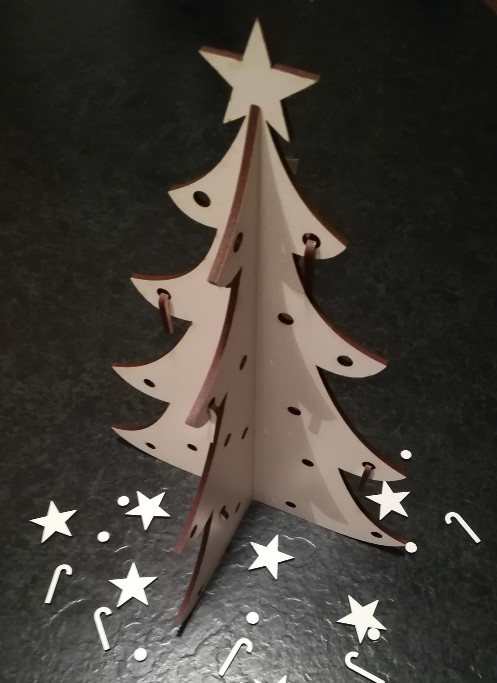

# Petit sapin de Noël décoratif

**License**: CC-BY-SA 4.0 [](http://creativecommons.org/licenses/by-sa/4.0)
Ce travail est sous licence [Creative Commons Attribution-ShareAlike 4.0 International License](http://creativecommons.org/licenses/by-sa/4.0)

## Présentation

Il s'agit d'un élément décoratif à disposer sur la table de Noël.
Le modèle en deux parties est à découper à la découpeuse laser par exemple, puis les deux parties sont emboîté l'une dans l'autre.
Le sapin pourra ainsi être démonté et rangé facilement.
Dimension des sapins (hors étoile): largeur 20cm, hauteur 28cm
<center>
  
  
  <i>Petit sapin de Noël et sa déco</i>
</center>

## Matériel

Un panneau de [matériau découpable au laser](https://wiki.fablab-lannion.org/index.php?title=Mat%C3%A9riaux_Laser) (carton, contreplaqué, MDF...) de dimension suffisante pour contenir les formes à découper, ici un panneau de 340 x 320 mm est suffisant en plaçant correctement les formes à découper.

En grande surface de bricolage on trouve :
  - des panneaux prédécoupés
  - du contreplaqué, MDF, etc... à la coupe
  - du contreplaqué, MDF, etc... à acheter en grand panneau et demander une découpe pour que ça entre sur la surface de travail de la découpeuse (1280 x 880 mm pour la [Keyland KQG1390](https://wiki.fablab-lannion.org/index.php?title=D%C3%A9coupeuses_Laser_Keyland#.22Grosse.22_Machine_:_KQG1390))

Pour moi ce sera un panneau de **MDF de 3 mm d'épaisseur, en 800 x 400 mm**, acheté en prédécoupé chez Mister Brico pour 2,90€, choisit le moins gondolé possible.

## Le modèle 2D

Le modèle 2D [sapin_noel.svg](./sapin_noel.svg) est réalisé au format SVG avec le logiciel [Inkscape](https://inkscape.org/fr)

### Installation d'Inkscape

Installation et configuration sont décrites dans le wiki [Chaîne logicielle pour découpeuse laser](https://wiki.fablab-lannion.org/index.php?title=Chaine_logicielle_pour_d%C3%A9coupeuse_laser).

_**Note:** Sous Ubuntu 18.04 LTS, il faut installer Inkscape avec la commande `sudo apt install inkscape`. En effet, lorsque Inkscape est installé avec Ubuntu Software au format [snap](https://doc.ubuntu-fr.org/snap), les répertoires pour installer les templates, palettes et extensions doivent se trouver dans `/home/<user>/snap/inkscape/current`, mais dans ce cas l'extension 'box generator' ne fonctionne pas (Erreur ImportError: No module named inkex) !_

### Les étapes du dessin vectoriel:

_**Note**: Le modèle est sauvegardé dans un fichier différent à chaque étape afin de pouvoir revenir en arrière en cas d'erreur._

1. Dans le logiciel Inkscape, créer un nouveau fichier à partir du template `laser template` (Menu Fichier->Nouveau à partir du template), afin d'avoir les limites de la zone de travail de la découpeuse laser [Keyland KQG1390](https://wiki.fablab-lannion.org/index.php?title=D%C3%A9coupeuses_Laser_Keyland#.22Grosse.22_Machine_:_KQG1390) (1280 x 880 mm)
2. On se place dans le coin inférieur gauche, coordonnées (0, 0) dans Inkscape, afin de profiter des règles horizontale et verticale pour mesurer le modèle. Activer la grille (Menu Affichage->Grille). Choisir la couleur rouge pour le contour (click-droit sur la couleur rouge de la palette en bas, puis 'Définir le fond') (Pas obligatoire ici, mais il faudra le faire à l'étape 'Creation')
3. Dessiner grossièrement la partie gauche du sapin avec l'outil "Courbe de Bézier" ([sapin_noel_etape_3.svg](./sapin_noel_etape_3.svg))
4.  Désactiver la grille (à cause de l'effet magnétique des points de la grille) et ajuster les segments à l'aide des poignées des points de Bézier afin de donner le fameux aspect "sapin neigeux" ([sapin_noel_etape_4.svg](./sapin_noel_etape_4.svg))
5. Sélectionner le demi-sapin. Copier (ctrl+c). Coller (ctrl+v). Symétrie horizontale (H). Puis placer ce demi-sapin en faisant coïncider les points "sommet du sapin". Sélectionner les deux demi-sapins (clic sur l'un puis shift-clic sur l'autre) et les unir (Menu Chemin->Union) ([sapin_noel_etape_5.svg](./sapin_noel_etape_5.svg))
6. Dupliquer le sapin (il en faut deux)
7. Placer les encoches. Afficher la grille. /!\ La largeur de l'encoche doit correspondre à l'épaisseur du panneau, ici 3 mm (ça rentre, mais il faut forcer un peu au montage/démontage)
    1. Sur chaque sapin: créer un rectangle représentant l'encoche et le placer sur l'axe de symétrie du sapin, à partir du milieu de la hauteur du sapin et jusqu'en haut pour l'un, et jusqu'en bas pour l'autre. Note: une fois un rectangle créé, on peut ajuster ses dimensions et sa position dans le bandeau du haut (X, Y, L, H) ([sapin_noel_etape_7.1.svg](./sapin_noel_etape_7.1.svg))
    2. Pour chaque sapin, sélectionner le sapin et son rectangle encoche et retirer l'encoche du sapin (Menu Chemin->Difference) ([sapin_noel_etape_7.2.svg](./sapin_noel_etape_7.2.svg))
    3. Vérification de placement des encoches: Sélectionner l'un des sapin et le positionner sur l'autre. Les encoches doivent être dans la continuité l'une de l'autre. Leur largeur doit correspondre à l'épaisseur du panneau, ici 3 mm
8.  Ajouter la décoration du sapin
    1. des boules (outil Cercle sur le bandeau de gauche), des étoiles (outil Etoile sur le bandeau de gauche), etc... dont les contours seront alors découpés.([sapin_noel_etape_8.svg](./sapin_noel_etape_8.svg))
    2. placer une étoile au sommet du sapin dont l'encoche est en bas. Intégrer l'étoile au sapin (sélectionner les deux éléments et les unir) ([sapin_noel_etape_8.2.svg](./sapin_noel_etape_8.2.svg))
9.  Optimisation de la surface de panneau
    1. pour chaque sapin, sélectionner le sapin et ses décorations puis click-droit->Group. Ils seront plus facile à déplacer
    2. sélectionner l'un des sapins et le placer en haut à gauche. Laisser un peu de marge par rapport au bord.
    3. sélectionner l'autre sapin, le renverser (Menu Object->Rotate 90%, deux fois), puis le placer plus près de l'autre sapin, en laissant un peu de marge aussi
10. Sauvegarder le modèle final ([sapin_noel.svg](./sapin_noel.svg)). Noter les dimensions minimale du plateau nécessaire, ici 340 x 320 mmm
11. On peut profiter des espaces libres pour y placer d'autres éléments de décoration à découper: étoiles, sucres d'orges, boules, etc... ([sapin_noel_et_deco.svg](./sapin_noel_et_deco.svg)). Il faut tout de même laisser un peu de place car au moment de la découpe, il faut faire des essais de réglage (un petit carré à découper dans un coin).

#### Les étapes en animation
```sh
$ convert -resize 1152x867 -delay 100 {1..9}*.png animation_1-9.gif
```


### La découpe laser

La marche à suivre est décrite dans le wiki [Chaîne logicielle pour découpeuse laser](https://wiki.fablab-lannion.org/index.php?title=Chaine_logicielle_pour_d%C3%A9coupeuse_laser) :
Pour résumer, il y a trois étapes :
1. [Creation](https://wiki.fablab-lannion.org/index.php?title=Chaine_logicielle_pour_d%C3%A9coupeuse_laser#Cr.C3.A9ation) à partir d'Inkscape: Il s'agit de tout convertir en chemin et d'associer une couleur différente à chaque type de découpe/gravure.
  Ici on a que de la découpe. On laisse tout en rouge.
2. [Export](https://wiki.fablab-lannion.org/index.php?title=Chaine_logicielle_pour_d%C3%A9coupeuse_laser#Export) au format AutoCAD DXF R14
3. [LaserWork](https://wiki.fablab-lannion.org/index.php?title=Chaine_logicielle_pour_d%C3%A9coupeuse_laser#LaserWork), la découpe laser avec le logiciel RDWorks.

Et voilà !


## Bibliographie

- [Les découpeuses Keyland KQG1390](https://wiki.fablab-lannion.org/index.php?title=D%C3%A9coupeuses_Laser_Keyland)
- [Chaîne logicielle pour découpeuse laser](https://wiki.fablab-lannion.org/index.php?title=Chaine_logicielle_pour_d%C3%A9coupeuse_laser)
- [Les formations Inskape du FabLab](https://wiki.fablab-lannion.org/index.php?title=FormationInkscape)
